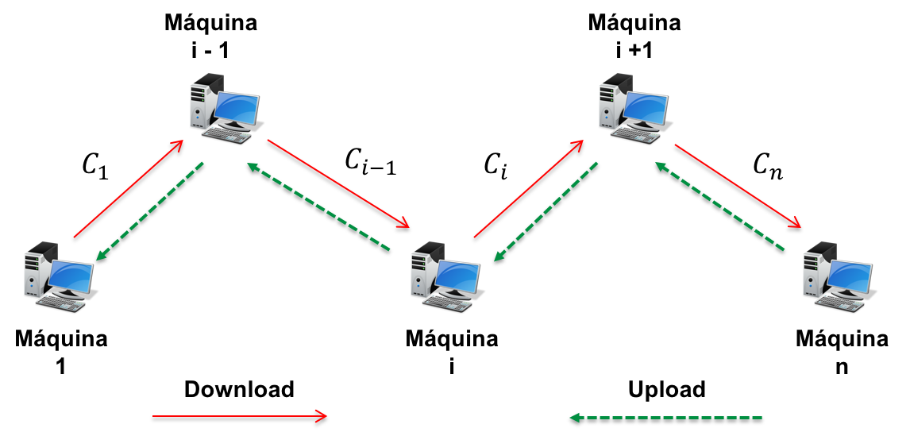
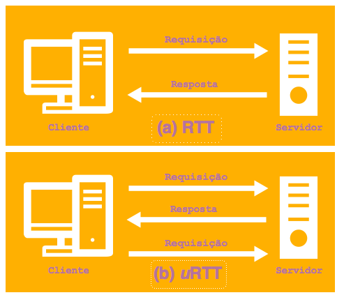

# Introdução

O avanço em infraestrutura computacional e a popularidade da Internet acentuam a importância da segurança da informação como um tema para discussões na comunidade científica.
Independente dos recursos de segurança cibernética existentes, milhões de ciberataques não são reportados ou acontecem sem o conhecimento da vítima [@Herd2013]. 

Em uma ação maliciosa, os invasores lançam os ataques às vítimas de forma indireta e sofisticada, para manter o anonimato na rede e burlar os recursos de segurança [@Kuo2010]. As invasões podem ser provenientes de qualquer parte do mundo, através do controle de uma conjunto de máquinas *stepping-stone*, que dificultam o rastreamento do ataque.

Uma *stepping-stone* pode ser definida como uma técnica que mantém o anonimato do cibercriminoso, através do envio de ataques por uma cadeia de máquinas interligadas entre si por acesso remoto [@Ding2011]. Esse ataque propicia ao intruso, a habilidade de acessar o sistema comprometido, anonimamente, para roubar informações confidenciais e vendê-las na rede. 

A primeira técnica para detectar intrusões por *stepping-stones* foi desenvolvida por [@Staniford-Chen1995], e conforme alguns trabalhos sugerem \cite{Daud2015, Kumar2016, Huang2016} [@Daud2015; @Huang2016; @Kumar2016; @Santos2017a], as estratégias para proteção de ataques por *stepping-stones* estão em constante aprimoramento. Em geral, as abordagens dos sistemas de detecção de intrusos para *stepping-stones* podem ser classificadas baseado em *thumbprint*, *watermark*, *steganography*, desvio padrão dos pacotes, estimativa do tamanho da conexão e em *crossover*.

No presente artigo, será estudado uma técnica híbrida, baseada na estimativa do tamanho da conexão em uRTT [@Ding2011] combinada a abordagem em *crossover* [@7474204]. Em comparação aos principais trabalhos relacionados, a abordagem atual aplica uma reanálise nos dados de [@7474204], para avaliar eventuais problemas no algoritmo proposto e reduzir a incidência de alertas falso-positivo dos resultados.

Como contribuições principais desse artigo, pode-se citar: (i) a confirmação da validade das técnicas propostas nos trabalhos de [@Ding2011; @7474204]; (ii) a proposta de um modelo híbrido de detecção de intrusos; (iii) a inclusão do intervalo de confiança para ampliar o índice de detecção proposto nos algoritmos anteriores; e (iv) o desenvolvimento de um algoritmo e validação em ambientes reais, por três arquiteturas distintas, e dentre estas, uma técnica configurada em diferentes países.

# Detectando *Stepping-Stones*

As invasões por *stepping-stones* apresentam como objetivo a realização de cibercrimes de forma anônima, permitindo ao invasor o acesso a outros computadores comprometidos em uma rede.

OS estudos realizados por [@Omar2008], [@Ding2011] e [@Huang2016], definiram alguns termos importantes para classificar os tipos de conexões remotas na execução de um ataques por *stepping-stones*:

* **Conexão**: Uma conexão entre dois *hosts* ocorre quando um usuário de um computador efetua um login em outro computador;

* **Cadeia**: Dado um conjunto de $n$ máquinas de $H = \{H_1, ..., H_n\}$, uma sequencia de conexões é definida como uma cadeia $C = \{C_1...C_n\}$, onde $C_i$ é uma conexão da máquina $H_i$ para o máquina $H_i+1$ para $i = \{1, .., n$\}, conforme pode ser visto na Figura \@ref(fig:fig1);

```{r fig1, echo=FALSE, fig.cap="Conexão por stepping-stones", out.width = '80%', fig.align='center'}

```

* **Download e Upload**: As comunicações entre os computadores são divididas pela direção da troca de informações entre as máquinas. Para o tráfego do tipo *download*, a comunicação, por exemplo, de uma conexão por *stepping-stones* acontece entre a máquina $1$ para a máquina $n$. Em contrapartida, para uma comunicação definida por *upload*, os pacotes realizam o caminho inverso, originando-se da máquina $n$ para a máquina $1$;
* **Requisição**: um pacote é definido como requisição se este participa de uma comunicação de \emph{download} e possui o sinalizadores "client"nos pacotes ssh;
* **Resposta**: Um pacote é definido como resposta, se este participa de uma comunicação de *download* ou *upload* e tem apenas flag "server";
* **Distribuição RTT**: É tempo calculado entre o envio de uma requisição para um destinatário, e recebimento de uma resposta pelo remetente. O cálculo do RTT é estimado para definir a média de tempo que o emissor pode esperar pela confirmação de entrega da mensagem ao destinatário [@Mittal:2015];
* **Distribuição uRTT**: É o cálculo do tempo entre o recebimento da primeira e segunda requisição pelo cliente, conforme pode ser visto na Figura \@ref(fig:urtt);

```{r urtt, echo=FALSE, fig.cap="Distribuição RTT e uRTT.", out.width = '50%', fig.align='center'}

```

* **Limites Intra-gap**: O limite *intra-gap* está associado ao intervalo de tempo existente entre o pressionamento de teclas individuais de um comando, Unix ou Windows, e, portanto, responsáveis pela formação de um pacote de dados que será enviado como requisição para o computador da vítima;
* **Limites Inter-gap**: É o intervalo de tempo computado entre dois limites consecutivos. Conforme [@Huang2016], esse limite consiste no gap entre o fim de uma sequência de caracteres determinando pela tecla *enter* e o primeiro caractere do próximo comando linux. Os limites *inter-gaps* são aplicados na técnica de estimativa do tamanho da cadeia de máquinas;

As propostas de [@Ding2011] e [@Zhang2014] são baseadas em duas técnicas distintas na detecção de intrusos. A abordagem de [@Ding2011], sugeriu um algoritmo para estimar a distância das conexões a partir do cálculo de ida e volta dos pacotes. Os autores introduziram o conceito de *u*RTT para mensurar o *gap* existente entre a máquina do intruso e o computador a ser invadido. Entretanto, o autor apresenta como principal limitação, a presença de cruzamento de pacotes nas conexões de ataque que influenciou no índice de precisão do algoritmo. 

Em [@Zhang2014], as limitações de [@Ding2011] foram aplicadas para criar uma nova estratégia de detecção de *stepping-stones*. A abordagem *crossover* computa o cruzamento de pacotes durante a comunicação das conexões. O autor observou que em conexões de ataques, o índice de pacotes *crossover* pode chegar em $53.64\%$, enquanto as conexões normais possui uma estimativa de $2.63\%$ pacotes crossover por experimento. Embora essa estratégia inicie uma nova era para detectar ataques por *stepping-stones*, ela foi projetada apenas para o protocolo SSH. Estudos sobre *crossover* aplicados a uma cadeia de proxies HTTP, TCP/IP, SOCKS ou Voip são necessários para validá-la como uma prova de conceito.

# Processo de Análise no Trabalho de Zhang

Para o desenvolvimento deste trabalho, foram utilizados os dados e o algoritmo do trabalho de [@7474204], com o objetivo de reanalisar a técnica *crossover* estudada e validar ou elicitar uma nova metodologia que complemente o índice de precisão do algoritmo.

## Características Experimentais do Trabalho de Zhang

A principal pergunta da pesquisa de [@7474204] inclui a **possibilidade de classificar *stepping-stones* formada por três máquinas entre as conexões formadas por uma máquina**. Para responder essa pergunta, foi necessário a configuração de experimentos, com os seguintes requisitos mínimos: 

* a configuração de dois computadores para exercer as funções de cliente e servidor localizadas na Universidade de Houston;
* formação de uma *stepping-stones* com duas máquinas situadas na cidade de Pittsburg, Pensilvânia;
* a interconectividade de todas as máquinas, uma a uma, entre si por conexões remotas por *SSH*;
* a execução do algoritmo em Python e o uso do analisador de protocolos *Wireshark* para captura do tráfego de pacotes na rede.

A coleta dos dados decorreu da configuração de quarenta experimentos, divididas entre longa e curtas conexões. A variável independente utilizado no experimento é o *timestamp* das conexões normais e de ataques, coletados individualmente pelo protocolo wireshark. As variáveis de resposta são: os limites *intra-gaps*, os limites *inter-gaps* e a eficiência dos limites *intra-gaps* e  *inter-gaps* classificados pela média desses valores. 

Após uma primeira análise, o autor sugeriu remover a variável *intra-gap*, pois estas medem essencialmente a velocidade de digitação de um usuário e não dependem do comprimento da cadeia. Entretanto, a variável *inter-gap* dependem do tamanho da cadeia e apresentam um número maior de pacotes *crossover*. Os dados foram disponibilizados em planilhas do tipo **CSV** para uma futura reanálise dos resultados.

Sobre a análise dos resultados do trabalho de  [@7474204] , foi utilizado uma matriz de confusão para avaliar as métricas de acurácia e a taxa de incidência de alarmes falso-positivo na classificação das conexões. Entretanto, não foi realizado teste de hipóteses ou determinação de intervalos de confiança das conexões, para verificar a significância estatística dos métodos abordados.

## Importanto as bibliotecas

As principais bibliotecas usadas na reanálise deste trabalho são: o `resample`, usado nos testes de permutação e o `boot`, para realizar *bootstrap* dos dados.

```{r setup, include=FALSE}
knitr::opts_chunk$set(
	echo = TRUE,
	error = FALSE,
	fig.height = 5,
	fig.width = 6,
	warning = FALSE,
	cache = TRUE,
	comment = NA
)
require(cowplot)
theme_set(theme_cowplot(font_size=12))
require(tidyverse)
library(pROC)
require(broom)
require(modelr)
library(mosaic)
library(dplyr)
library(ggplot2)
library(broom)
library(GGally)
library(ggfortify)
library("e1071")
library(knitr)
library(lubridate)
library(scales)
library(party)
library(rpart)
library(resample) # <-- Para bootstrap!
library(boot) # <-- Para bootstrap!

theme_set(theme_bw())
```

## Análise e exploração dos dados

Os dados analisados, são provenientes do trabalho de [@7474204], após uma configuração de quarenta experimentos, sendo vinte para longas conexões (*long-chain*) e vinte para curtas conexões (*short-chain*). 

Cada coluna é composta por um experimento que são classificados pelos limites *inter-gaps* calculados pelo algoritmo. Nos dados, é possível verificar a presença de valores NA`s. Portanto, para não ocasionar problemas, é necessário limpar os dados para removê-los.

```{r fig2, echo=FALSE, fig.cap="\\label{fig:fig2}Análise do dataset", fig.align='center'}
#Removendo os primeiros valores que são vazios
short = read.csv(file = "/Users/amandasouza/Desktop/Documentos/short-chain.csv", skip = 2, header=FALSE)
long = read.csv("/Users/amandasouza/Desktop/Documentos/long-chain.csv", skip = 2, header=FALSE)

plot.short = short %>% tidyr::gather("id", "value", 1:20) %>% 
  ggplot(aes(id, value))+
  scale_y_log10() + 
  geom_point(position = position_jitter(width = 0.2), alpha = 0.2, color = "blue") +
  geom_boxplot(width = 0.9) +
 theme_classic() +
  labs(x='Experimentos', y='Limites Inter-gaps', title = "Valores das curtas conexões\n")  +
   theme(axis.text.x=element_blank(),
        axis.ticks.x=element_blank())

plot.long = long %>% tidyr::gather("id", "value", 1:20) %>% 
  ggplot(aes(id, value)) +
  scale_y_log10() + 
  geom_point(position = position_jitter(width = 0.2), alpha = 0.2, color = "blue") +
  geom_boxplot(width = 0.9) +
  theme_classic() +
  labs(x='Experimentos', y='Limites Inter-gaps', title = "Valores das longas conexões\n")  +
   theme(axis.text.x=element_blank(),
        axis.ticks.x=element_blank())

plot1 = plot_grid(plot.short, plot.long, ncol = 2)

print(plot1)
ggsave("plot-d.pdf", width = 6, height = 4)
```

O gráfico de boxplot \@ref(fig:fig2), representa os dois tipos de *datasets*. Nele, é possível verificar uma presença maior de *outliers* nos limites *inter-gaps* das longas conexões. Também, é possível visualizar uma presença de *outliers* superiores nas longas conexões, podendo enfatizar que os dados das longas conexões apresentam um comportamento diferente das conexões normais.

## Calculando *Maximum Gap Ratios* (mgr)

Para calcular *Maximum Gap Ratios*, primerio é realizado cálculo do *ratio* dos limites *inter-gaps*. Assim, seja $i = [1,...,n]$, um vetor de valores dos limites *inter-gaps* em ordem crescente, e $i$ é o número de iterações de $1$ até o $n$-ésimo valor do limite *inter-gap*, temos:

\begin{equation}
\begin{aligned}
ratio(x) = \sum_{i=1}^{n} \frac{|x_i|} {x_{i - 1}}\left \{ \begin{matrix}x_i \ne 0\\x_i > x_{i - 1} \end{matrix}\right.
\end{aligned}
\end{equation}

Após o cálculo do *ratio(x)*, é necessário classificar o  *Maximum Gap Ratios* com a seguinte equação:

\begin{equation}
\begin{aligned}
mgr(x) = max\{ratio(x)\}.
\end{aligned}
\end{equation}

O  *Maximum Gap Ratios* são responsáveis pela computação dos pacotes *crossovers* de uma conexão.

Após um total de quarenta experimentos, os autores delimitaram um limiar para detecção de intrusos por *stepping-stones*. Os valores ordenados em ordem crescente e o threshold podem ser visualizados na Figura \@ref(fig:fig3).

```{r fig3, echo=FALSE, fig.align='center', fig.cap="\\label{fig:fig3}MRG das Conexões", message=FALSE, warning=FALSE}
#Função para calcular ratios
getRatios <- function(x){ (x - lag(x))/lag(x)}
 
#Calcula os ratios
long = mutate_if(long, is.numeric, getRatios)
short = mutate_if(short, is.numeric, getRatios)

#Remove celulas vazias 
short <- drop_na(short)
long <- drop_na(long)

#Aplica o MGR 
short_max = short %>% summarise_each(funs(max), contains("V"))
long_max = long %>% summarise_each(funs(max), contains("V"))

#Inverte a tabela dos resultados
short_max = as.data.frame(t(short_max))
long_max = as.data.frame(t(long_max))

rownames(short_max) <- NULL;
rownames(long_max) <- NULL;

colnames(short_max)[1] <- "mgr"
colnames(long_max)[1] <- "mgr"

short_max["type"] <- "short"
long_max["type"] <- "long"

#Mixando tabelas
original = long_max %>%
  rbind(short_max)

#Organizando valores em ordem crescente
original = original[order(original$mgr, decreasing=FALSE), ] 

#Criando sequencia
original <- original %>%
  arrange(mgr) %>%
  mutate(sequencia = 1:nrow(original))

plot = original %>%
  ggplot(aes(sequencia, mgr, color = type)) +
  geom_point() +
  labs(title = "Maximum Gap Ratios para longas e curtas conexões\n",
       x ="Experimentos", 
         y = "\nMGR(Inter-Gaps)",
         color = "Conexão") +
  geom_hline(yintercept = quantile(original$mgr, 0.556)[[1]], colour="black", lty = 2)  +
  geom_text(aes(2.8,5,label=sprintf("Threshold"), vjust = -0.5, angle= 0), colour="black") +
  scale_color_brewer(palette="Set1") +
  scale_y_continuous(limits = c(0, 13), breaks  = seq(0, 1.2 * max(original$mgr), by = 1)) +
  theme( plot.title = element_text(color="#201d1d", size=12, 
                                    face="bold", hjust = 0.5),
          axis.title = element_text(color="#201d1d", 
                                    face="bold", size=11),
          panel.grid.major.y = element_blank())

print(plot)
ggsave("plot-a.pdf", width = 6, height = 4)
```

No gráfico da Figura \@ref(fig:fig3), são apresentados os *Maximum Gap Ratios* para longas conexões (cículos vermelhos) e os *Maximum Gap Ratios* para curtas conexões. Para longas conexões, um valor foi detectado como falso positivo, ou seja, um gap de uma conexão normal foi detectado como ataque. Nas curtas conexões, três valores foram detectados como falso negativos, ou como gaps provenientes de ataques. 

Um ponto importante observado no trabalho atual, foi a delimitação de uma limiar diferente do citado pelo autores em [@7474204]. O limiar delimitado pelos autores no artigo original foi $threshold = 6$. Entretanto, na reanálise para os mesmos dados, e aplicando a mesma técnica, o limiar apresentou uma alteração. Para que os resultados apresentassem a mesma acurácia, foi delimitado um $threshold = 5$. 

O fator de erro humano pode explicar o *trade-off* entre os valores originais e os valores da reanálise. Na análise do artigo original, o processo foi totalmente manual, com o uso da ferramenta microsoft excel. No trabalho atual, usou-se o rstudio como ferramenta de exploração dos dados. Sabe-se assim que, uma análise manual pode ocasionar problemas e até mesmo um erro de cálculo, como pode ser visto nos resultados apresentados na Figura .

Para verificar a acurácia do trabalho, os autores aplicaram uma matriz de confusão nos valores do *Maximum Gap Ratios*. A tabela abaixo apresenta os resultados concluídos pelos autores:

```{r}
#Reorganizando os dados para calcular a matriz de confusão
novo_dataset <- original %>% 
    select(mgr, type, sequencia) %>%
    mutate(type = ifelse(type == "long",  yes = 1, no = 0))

# Métricas da matriz de confusão
get_metrics<- function(df,cutoff = 0.6)
{
  tp<-0
  fp<-0
  fn<-0
  tn<-0
  
  for (i in 1:nrow(df))
  {
    true_val<- df[i,2]
    pred_val<- df[i,1]
    if(pred_val>=cutoff && true_val =="long")
      tp<-tp+1 
    if(pred_val<cutoff && true_val =="long")
      fn<- fn+1
    if(pred_val>=cutoff && true_val =="short")
      fp<- fp+1
    if(pred_val<cutoff && true_val =="short")
      tn<- tn+1
  }
  n<- tp+tn+fp+fn
  tp_rate<- tp/(tp+fn)
  fp_rate<- fp/(tn+fp)
  fn_rate<- fn/(tn+fp)
  accuracy<- (tp+tn)/n
  recall<- tp/(tp+fn)
  precision<- tp/(tp+fp)
  fmeasure<-(2*precision*recall)/(precision + recall)
  threshold <- 0.6
  
  out<- data.frame(tp_rate,fp_rate, fn_rate,accuracy,recall, threshold)
  colnames(out)<- c("tp_rate","fp_rate","fn_rate" ,"accuracy","recall", "threshold")
  return ( out )
}


get_metrics(experimentos) 

```

Para um $threshold = 5$ a taxa de precisão do algoritmo foi de $85\%$ de detecção das longas conexões. Assim, das vinte conexões de ataque testadas, apenas três não foram detectadas pelo algoritmo, e assim consideradas falso negativa. A taxa de falso positivo foi de $5\%$, ou seja, das vinte conexões normais testadas, apenas uma foi detectada como ataque.

Na figura \@ref(fig:fig4), é possível verificar as conexões detectadas pelo algoritmo:

```{r fig4, echo=FALSE, fig.align='center', fig.cap="\\label{fig:fig4}Distribuição das Métricas de Deteção" }
tree <- ctree(mgr ~ ., data=novo_dataset, 
                controls = ctree_control(
                  teststat="quad",
                  testtype="Univariate",
                  mincriterion=.95,
                  minsplit=10, 
                  minbucket=5,
                  maxdepth=0
                ))
  
novo_dataset$pred <- predict(tree, newdata=novo_dataset, type="prob")
novo_dataset$pred <- unlist(lapply(novo_dataset$pred, function(el)el[1]))
  
plot_pred_type_distribution <- function(df, threshold = 5) {
  for (i in 1:nrow(df))
  {
  v <- rep(NA, nrow(df))
  v <- ifelse(df$pred >= threshold & df$type == 1, "TP", v)
  v <- ifelse(df$pred >= threshold & df$type == 0, "FP", v)
  v <- ifelse(df$pred < threshold & df$type == 1, "FN", v)
  v <- ifelse(df$pred < threshold & df$type == 0, "TN", v)
  
  df$pred_type <- v
  }
  
 return(df)
}

novo_dataset = plot_pred_type_distribution(novo_dataset)
threshold = 5
plot1 = novo_dataset %>%
 ggplot(aes(x=type, y=pred)) + 
  geom_point() +
    geom_violin(fill=rgb(1,1,1,alpha=0.6), color="gray") + 
    geom_jitter(aes(color=pred_type), alpha=0.9) +
    geom_hline(yintercept=threshold, color="red", alpha=0.6) +
    scale_color_brewer(palette="Set1", name = "Métricas") +
    labs(title = "Distribuição das Métricas de Detecção do Algoritmo\n",
       x ="Classificação", 
         y = "\nMGR(Inter-Gaps)") + theme_classic()  +
  theme( plot.title = element_text(color="#201d1d", size=12, 
                                    face="bold", hjust = 0.5),
          axis.title = element_text(color="#201d1d", 
                                    face="bold", size=11),
          panel.grid.major.y = element_blank())
print(plot1)
ggsave("plot-a.pdf", width = 6, height = 4)
```

A Figura \@ref(fig:fig4) fornece uma avaliação visual simples da taxa de falsos alarmes do método na detecção de conexão longas apresentadas por [@7474204]. Os autores afirmam que a quantidade de falsos positivos/negativos podem ser toleráveis, devido ao alto índice de detecção do algoritmo. Assim, é possível notar sucesso no objetivo do trabalho em identificar longas cadeias formadas por três máquinas contra uma conexão normal formada por uma máquina. Os autores ainda afirmam uma taxa de detecção de 100% em longas conexões formadas por mais de cinco computadores.

# Reanálise dos dados com uma nova metodologia

```{r}
median_chain <- function(dados, i){
    x1 <- sample(1:20, 1)
    value = median(dados[[x1]])
    return(value)
}

bootstraps_long <- boot(data = long, statistic = median_chain, R = 1000)
mean_long = drop_na(as.data.frame(as.numeric(bootstraps_long$t)))

bootstraps_short <- boot(data = short, statistic = median_chain, R = 1000)
mean_short = drop_na(as.data.frame(as.numeric(bootstraps_short$t)))

ci <- setNames(data.frame(matrix(ncol = 4, nrow = 2)), c("lower", "upper", "mean", "group"))

basic <- sapply(ci, function(y) boot.ci(bootstraps_long, conf = 0.95, type = "basic")$basic[4:5])
ci[2, ] = basic[1:4]
ci[2, ncol(ci) - 1]<- median(basic)
ci = drop_na(ci)
ci[1, 4] <- "long"

basic <- sapply(ci, function(y) boot.ci(bootstraps_short, conf = 0.95, type = "basic")$basic[4:5])
ci[3, ] = basic[1:4]
ci[3, ncol(ci) - 1]<- median(basic)
ci = drop_na(ci)
ci[2, 4] <- "short"

plot1 = ci %>%
  ggplot(aes(x = 1, y = mean, color = group)) +
  geom_pointrange(aes(ymin = lower, ymax = upper), position = position_dodge(width = 1)) +
  scale_color_brewer("Tipo de Conexão", palette = "Set1", guide = guide_legend(ncol = 2)) +
  labs(x = NULL, y = "IC por Conexão") +
  geom_text(aes(label = sprintf("%.4f", mean), y = upper + 0.0025, vjust = "bottom"),
            position = position_dodge(width = 1)) +
  theme_classic() +
  theme(legend.position = "bottom")

#print(plot1)
#ggsave("plot-c.pdf", width = 6, height = 4)

```

```{r}
colnames(mean_short)[1] <- "value"
colnames(mean_long)[1] <- "value"
mean_short["type"] <- "short"
mean_long["type"] <- "long"

experimentos = mean_long %>%
  rbind(mean_short)

experimentos = unique(experimentos)

experimentos = experimentos[order(experimentos$value, decreasing=FALSE), ]

experimentos <- experimentos %>%
  mutate(sequence = as.numeric(1:n()))

model = lm(value ~ type, experimentos)
tidy(model, conf.int = TRUE, conf.level = 0.95)
glance(model) %>% kable()
```

```{r}
wilcox_test <- function(dados, i){
    x1 <- sample(1:20, 1)
    x2 <- sample(1:20, 1)
    value_a = short[x1]
    value_b = long[x2]
    colnames(value_a)[1] <- "ig"
    colnames(value_b)[1] <- "ig"
    return(wilcox.test(value_a$ig, long_one$ig,
                       alternative = "two.sided")$p.value)
}

bootstraps_long <- boot(data = experimentos, statistic = wilcox_test, R = 100)

pvalues = bootstraps_long$t
colnames(pvalues)[1] <- "ig"


pvalue$p.value
pvalue$stats %>% t() %>% kable()

pvalue2 = experimentos %>%
      permutationTest2(median_chain(value),
                       treatment = type,
                       alternative = "two.sided",
                       R = 10000)

pvalue2$stats %>% t() %>% kable()

plot3 = experimentos %>%
  ggplot(aes(1:nrow(experimentos), value, color = type)) +
  geom_point() +
  labs(title = "Mediana das conexões (inter-gaps)\n",
       x ="Experimentos", 
         y = "Mediana(inter-gaps)",
         color = "Conexão") + 
  geom_hline(yintercept = quantile(experimentos$value, 0.6)[[1]], colour="black", lty = 2)  +
  geom_text(aes(2.8,0.8,label=sprintf("Threshold"), vjust = -0.5, angle= 0), colour="black") +
  theme_classic() +
   theme( plot.title = element_text(color="#201d1d", size=12, 
                                    face="bold", hjust = 0.5),
          axis.title = element_text(color="#201d1d", 
                                    face="bold", size=11),
          panel.grid.major.y = element_blank())

print(plot3)
#ggsave("plot-f.pdf", width = 6, height = 4)

get_metrics(experimentos)
```


# Referencias